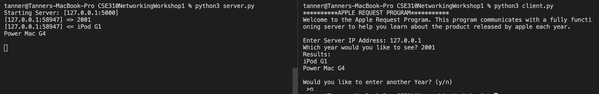
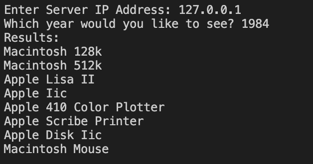
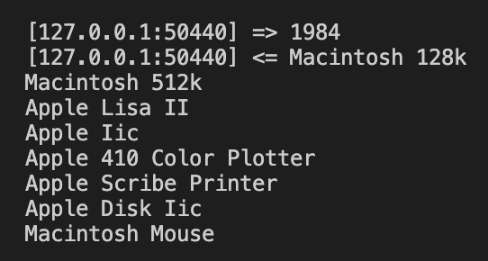

# Apple Request Program #
## Description ##
This program is a simple socket program designed to display apple products based on the information. The socket program works by hosing a server on your local machine. This means that although the program is acting as a server, it is not conntected to a network. This program shows how a request is recieved and how an answer is outputted from the server. Quite simply, a client asks for something, and the server returns an answer. 

This particular networking application is written as a UDP networking model because it does not check for the connection, instead it waits for the client to send a request. 

## Setup and Execution ##
This program is set up originally through the language Python. Installation of python is easy. Simply go to the website Python.org and download the latest virsion of python. After that, go to visualstudio.microsoft.com to download visual studio code. This is a lightweight ide that can be used to run this simple program. 

Once everything is installed, download all the files in this file. In an open terminal window, use the command `pip install pandas` to install the necessary packages for the socket program. To run the program, open the file folder inside visual studios. In the top menu, select "terminal" and then "split terminal". This will allow you to run the server and the client at the same time. `python3 server.py` and `python3 client.py` will run both programs.

## Message Structure ##
To send messages between the client and server, the programs have to convert the information through bytes. For example, input is taken in as a string or integer. This is then converted to bytes and then sent to the server. The server converts this input back to a string and then uses it to compare with the data from the [AppleData.csv](./AppleData.csv) file. To return a response, the server converts the data to bytes again.

## Screenshots ##

The two programs running side by side

A client input and output example

A server example

## Useful Websites ##
* [Python Video Tutorial](https://www.youtube.com/watch?v=u4kr7EFxAKk)
* [Python Socket Libraries](https://docs.python.org/3.6/library/socket.html)